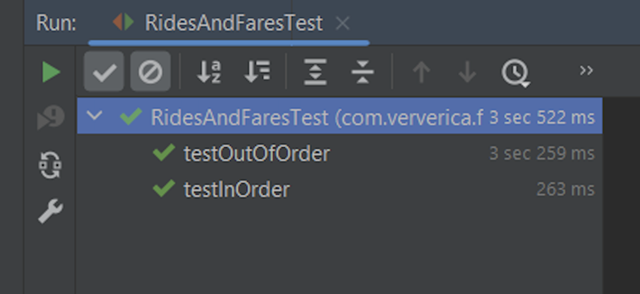
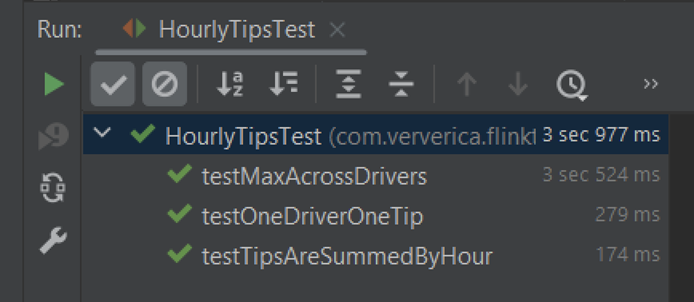
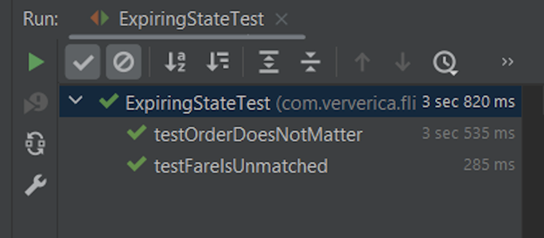

# Лабораторная работа №3
## Stream processing with Apache Flink

Выполнить следующие задания из набора заданий репозитория https://github.com/ververica/flink-training-exercises:
  - RideCleanisingExercise
  - RidesAndFaresExercise
  - HourlyTipsExerxise
  - ExpiringStateExercise

**1. RideCleansing**

**2. RideAndFares**

**3. HourlyTips**

**4. ExpiringState**

